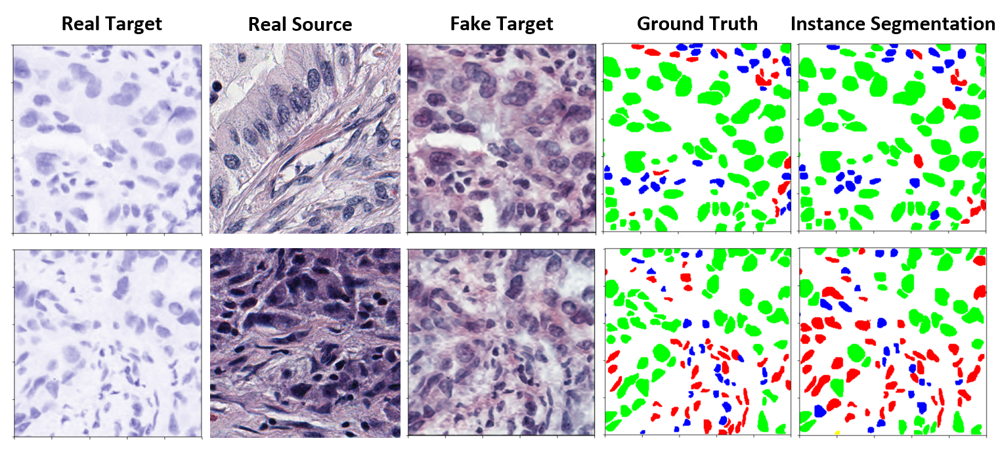
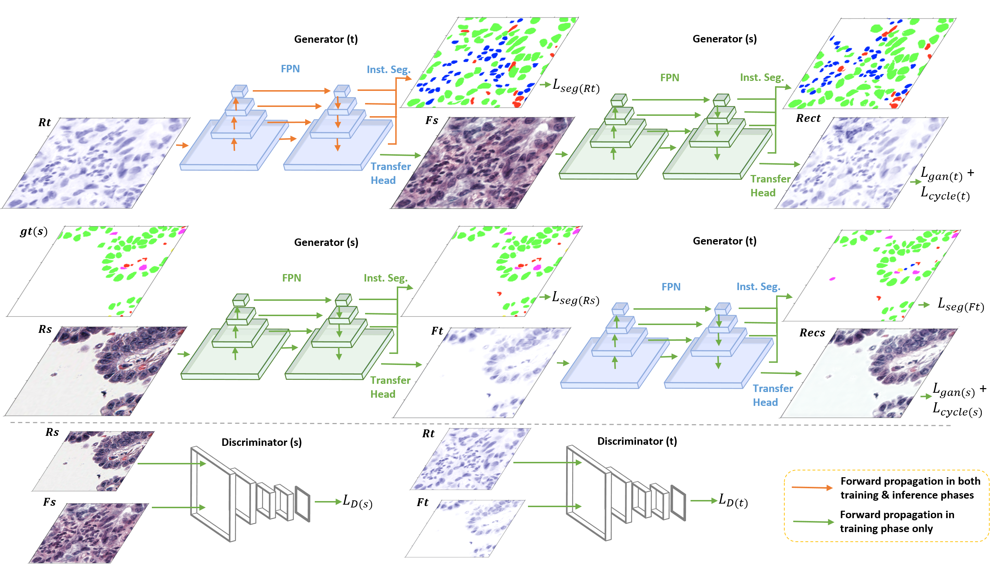

# InstanceSegmentation-CyC-GAN

An instance segmentation network for unsupervised domain adaptation based on CyC-GAN.

## Task overview

## Model architecture

## Files

___You can use https://nbviewer.jupyter.org/ and paste the .ipynb link into it if Girhub does not render the file properly___

### To train ISC-GAN:

* Train seg-GAN-curriculum step1.ipynb to segment fake target image

* Train seg-GAN-curriculum step2.ipynb to segment real target image

### To evaluate:

* Evaluate seg-GAN-curriculum.ipynb

## Requirements:

matplotlib==3.0.3

numpy==1.17.2

opencv-python==3.2.0.7

pycocotools==2.0.0

scikit-image==0.15.0

scipy==1.2.1

torch==1.4.0

torchvision==0.5.0

## Citation:

___Temporarily unavailable___
